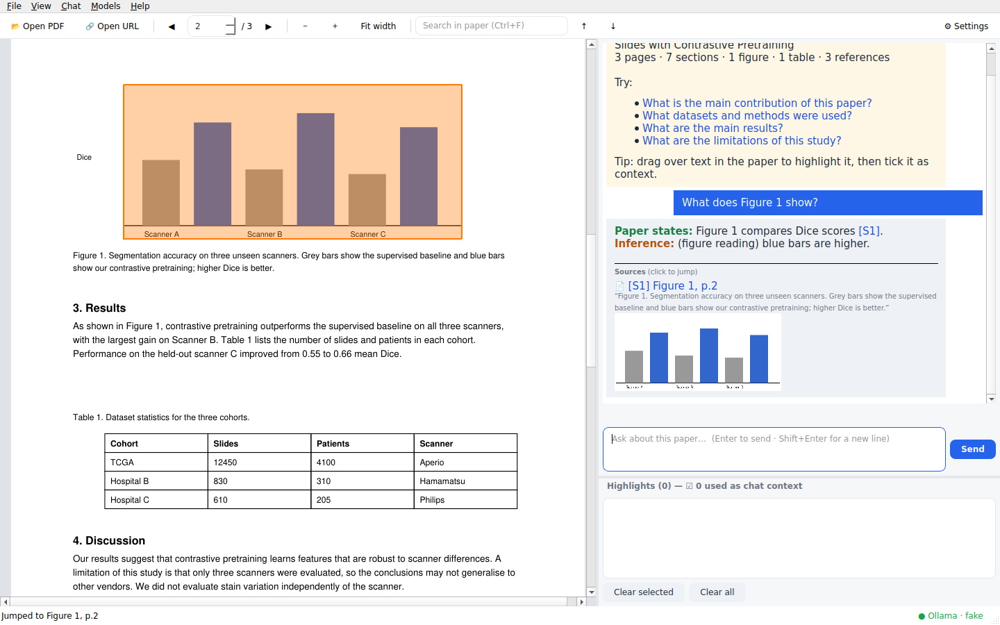
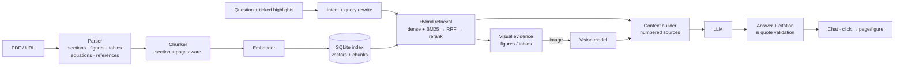

<p align="center"></p>

<h1 align="center">Literature Buddy</h1>
<p align="center"><b>A local, evidence-grounded reading assistant for scientific papers.</b><br>
PDF viewer · hybrid RAG · figure &amp; table understanding · cited answers you can click to verify.</p>

<p align="center"><br>
<sub>Headless render of the real UI against a stub model server (the answer text is canned; the layout, highlighting, citations and figure thumbnail are real).</sub></p>

---

## Why

General chatbots happily invent details about papers. Literature Buddy is built around one rule: **every claim must be traceable to the paper**.

* Answers are split into **Paper states** (with `[S1]` citations), **Inference**, and **General scientific context**, so you always know what came from the authors and what did not.
* Citations are validated: markers pointing to non-existent sources are stripped, and quoted text that does not appear verbatim in the paper is flagged.
* Click a citation and the viewer jumps to the exact page and outlines the passage or figure.
* If the paper does not contain the answer it says: *"I could not find evidence for this claim in the paper."*
* Runs **fully locally** (Ollama, or Transformers/llama.cpp with local weights). If you point it at a remote server, the UI tells you and asks first.

## Features

| Area | What you get |
|---|---|
| **Reading** | Continuous-scroll PDF viewer, zoom / fit width, page jump, full-text search, drag-and-drop, click-to-open |
| **Highlights** | Drag over text to highlight. Tick a highlight to use it as chat context; *Clear selected / Clear all*; highlights persist per paper |
| **Understanding** | Sections (abstract → conclusion), title/authors, **figures** (raster and vector), **tables** (as Markdown), **equations**, references, captions linked to the text that mentions them |
| **Retrieval** | Section-aware chunks with exact page numbers · dense + BM25 hybrid search · reciprocal-rank fusion · optional cross-encoder rerank · text ↔ figure linking |
| **Vision** | A vision-language model reads the *actual figure image* when you ask about it (results cached). Its output is labelled *model-generated* and never counts as paper text |
| **Chat** | Streaming answers, follow-up questions (pronoun resolution), rolling memory, persistent per-paper history, export to Markdown |
| **Sources** | Local PDF, or URL: arXiv, bioRxiv/medRxiv, PubMed Central (Europe PMC), or any page exposing a `citation_pdf_url` |

## How it works



More detail in [docs/architecture.md](docs/architecture.md).

## Quick start

Requires **Python 3.11+**. Pick one path.

### Path A – Ollama (easiest, no PyTorch)

```bash
git clone https://github.com/abubakr-shafique/Literature_Buddy && cd literature_buddy
python -m venv .venv && source .venv/bin/activate      # Windows: .venv\Scripts\activate
pip install -r requirements.txt && pip install -e . --no-deps

# install Ollama from https://ollama.com, then:
ollama pull qwen3.5:9b            # 16 GB GPUs   (use qwen3.8:27b for 24 GB GPUs)
ollama pull qwen3-embedding:0.6b

literature-buddy --profile 16gb-ollama examples/sample_paper.pdf
```

### Path B – Transformers with local weights (fully offline afterwards)

```bash
pip install torch torchvision --index-url https://download.pytorch.org/whl/cu130   # pick your CUDA build: pytorch.org
pip install -r requirements-transformers.txt && pip install -e . --no-deps
python scripts/download_models.py --profile 16gb          # or 24gb  → ./models
LB_OFFLINE=true literature-buddy --profile 16gb paper.pdf
```

### Check your setup

```bash
literature-buddy check --profile 16gb-ollama     # versions, GPU, backend reachable?
```

## Hardware profiles

| Profile | Backend | Chat + vision model (one model does both) | Approx. weights | Extras |
|---|---|---|---|---|
| `16gb` | Transformers + bitsandbytes 4-bit | `Qwen/Qwen3.5-9B` | ~6–7 GB | Qwen3-Embedding-0.6B, bge-reranker-v2-m3 |
| `24gb` | Transformers + bitsandbytes 4-bit | `Qwen/Qwen3.8-27B` | ~15–17 GB | same |
| `16gb-ollama` | Ollama (GGUF) | `qwen3.5:9b` | ~6.6 GB | Ollama embeddings, no rerank |
| `24gb-ollama` | Ollama (GGUF) | `qwen3.8:27b` | ~17–18 GB | Ollama embeddings, no rerank |
| `lite` | Ollama | `gemma4:12b` | ~7.6 GB | lexical embeddings, no downloads |

Qwen3.5+ and Gemma 4 are natively vision-language models, so **one loaded model serves both text and figures**, which avoids swapping two large models in VRAM. Alternatives, sizes, licences and caveats: [docs/model-selection.md](docs/model-selection.md).

Switch profile with `--profile`, `LB_PROFILE`, or **⚙ Settings**. Override anything, e.g. `LB_LLM__MODEL=gemma4:26b`.

## Using the app

1. **Open a paper**: click the left panel, `Ctrl+O`, drag a PDF in, or `Ctrl+L` for a URL. The first open parses and indexes the paper (progress bar at the bottom); reopening is instant.
2. **Read**: scroll, `Ctrl+wheel` to zoom, `Ctrl+F` to search.
3. **Highlight**: drag across text. It turns yellow and appears in *Highlights* with a ☑. Ticked highlights are sent to the model as top-priority context; untick to ignore, *Clear selected / Clear all* to remove. Right-click a highlight to copy or delete it.
4. **Ask**: type in the chat (Enter sends). Try *"What datasets were used?"*, *"What does Figure 2 show?"*, *"Compare Table 1 with the results in the text"*, *"What are the limitations?"*, or select a paragraph and ask *"Explain this"*.
5. **Verify**: click any `[S1]` marker or source card to jump to the evidence. Figures are outlined and shown as thumbnails.
6. **Stop** a long answer with the red button; **Chat → Clear chat** starts over; **File → Export chat** saves Markdown.

Full guide with tips and troubleshooting: [docs/usage.md](docs/usage.md).

### Command line

```bash
literature-buddy [paper.pdf|URL]              # GUI
literature-buddy index paper.pdf              # parse + embed only
literature-buddy ask paper.pdf "What is the sample size?"   # headless Q&A with sources
literature-buddy check | profiles
```

## Configuration

Order of precedence: **defaults → profile → user config → `LB_*` environment variables**.
User config is `./config.yaml` or `~/.config/literature-buddy/config.yaml` (written by ⚙ Settings). See `.env.example` and the schema in [`src/literature_buddy/config/settings.py`](src/literature_buddy/config/settings.py).

```yaml
# config.yaml
llm: { provider: openai_compat, base_url: http://localhost:8000, model: my-served-model }  # vLLM, llama-server, LM Studio
retrieval: { top_k: 10, rerank: true }
data_dir: ./data
offline: true
```

## Project layout

```
src/literature_buddy/
  config/      typed settings + hardware profiles (YAML)
  document/    layout analysis, parser, figure/table extraction, chunker, URL loader, processor
  retrieval/   embeddings, BM25, SQLite vector store, hybrid retriever, reranker, multimodal linking
  models/      Ollama · OpenAI-compatible · Transformers (LLM+VLM) · llama.cpp · ModelManager
  rag/         intent, prompts, memory, context builder, citations, pipeline
  storage/     paper cache + library DB (recents, chat history, highlights)
  gui/         PySide6: viewer, chat, highlights, settings, main window
scripts/       download_models.py, make_sample_pdf.py
tests/         49 tests incl. headless GUI tests against a fake Ollama server
```

## Development

```bash
pip install -r requirements-dev.txt && pip install -e . --no-deps
QT_QPA_PLATFORM=offscreen pytest      # 49 tests, no GPU or model downloads needed
ruff check src tests scripts
```

See [docs/development.md](docs/development.md) to add a backend, tune prompts, or plug in another parser.

## Privacy & security

* Everything (PDF, index, chat, highlights) stays in `data_dir`; nothing is sent anywhere unless you configure a remote endpoint, in which case the status bar shows **☁ data leaves this machine** and you must confirm.
* URL downloads: http(s) only, private/loopback addresses refused, redirects re-validated, size-capped, `%PDF-` magic check. PDFs are only parsed/rendered by MuPDF; nothing inside them is executed.
* `LB_OFFLINE=true` blocks Hugging Face Hub access.

## Status & known limitations

This is a v0.1 foundation. Please read this before trusting it with important work:

* **Layout heuristics were validated on synthetic PDFs, not a broad corpus of real journal PDFs.** Section, caption, figure-region and table detection are rule-based and will misfire on unusual layouts (e.g. figures without captions, sideways tables, heavy multi-column floats). Expect to tune `document/` on your own papers. A benchmark set is on the roadmap.
* **The GPU inference paths (Transformers 4/8-bit, llama.cpp) have not been exercised in CI**: they are thin wrappers, but verify them on your hardware with `literature-buddy check`. Hybrid-architecture models may need extra fast-path libraries (see the model card) to be quick under Transformers; Ollama is the reliable fast path.
* Text selection is per page; scanned PDFs need Tesseract for OCR; equations are detected only when numbered; author extraction is best-effort.
* Model output can still be wrong. The citation/quote checks catch fabricated markers and unquoted claims cannot be fully verified: treat citations as pointers to check, especially for numbers.

## Roadmap

Multi-paper library and cross-paper questions (swap the vector store for LanceDB) · supplementary-file linking · GROBID/Docling parser adapters · retrieval & parsing benchmark suite · answer-faithfulness scoring · packaged installers.

## License

**AGPL-3.0-or-later.** The project depends on [PyMuPDF](https://github.com/pymupdf/PyMuPDF), which is AGPL/commercial-licensed, so distributing the combined work requires an AGPL-compatible licence. If you need a permissive licence, replace the parser's PyMuPDF calls (`document/layout.py`, `parser.py`, `figure_extractor.py`, `table_extractor.py`, `gui/pdf_viewer.py`) or obtain a PyMuPDF commercial licence. Model licences (Apache-2.0 for the default Qwen and Gemma 4 models at time of writing) are separate: check each model card.

## Acknowledgements

PyMuPDF, PySide6, Qwen, Gemma, BAAI (bge), Ollama, sentence-transformers.
