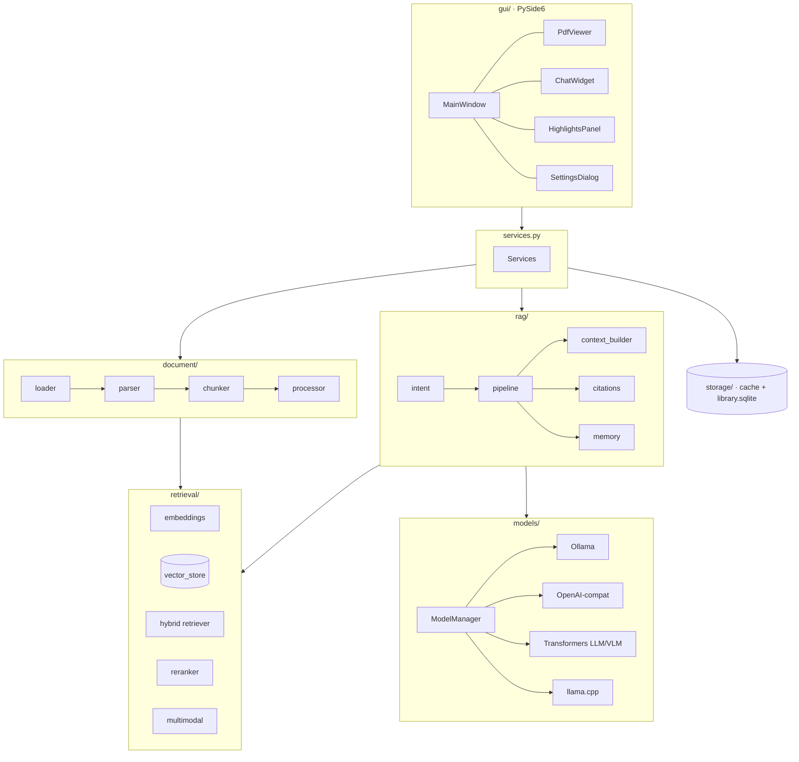
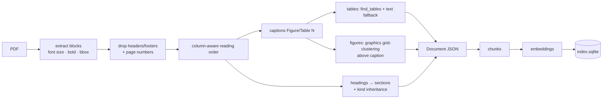
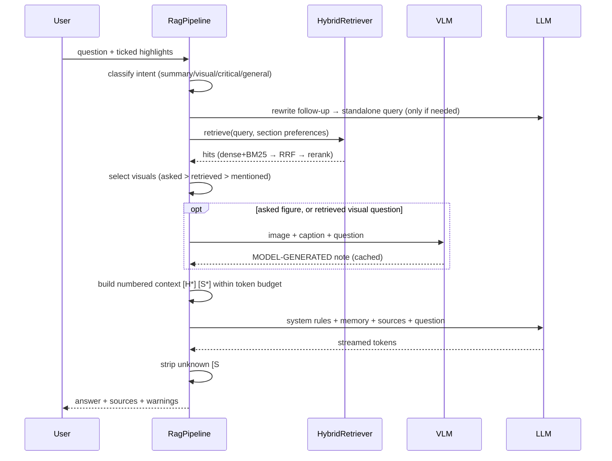

# Architecture

## Layers



Dependencies point downwards only; `gui/` is the only layer that imports Qt (except `gui/tasks.py`), so the whole pipeline is usable headlessly (`literature-buddy ask …`) and testable without a display.

## Ingestion



Key decisions:

| Decision | Why |
|---|---|
| Figure regions found by **clustering vector drawings and images on an occupancy grid**, then attaching the cluster above a caption | Works for raster and vector plots, multi-panel figures, and needs no layout model |
| Chunks **never cross a section or page boundary** | Every citation has one exact page; sections drive boosting (methods/results/discussion) |
| Figure/table chunks carry the sentences that *refer to* them | Lets a text question about "the result" retrieve the figure, and vice versa |
| **SQLite + numpy** instead of FAISS/Chroma/Qdrant | One paper = hundreds of chunks: exact search is instant, index is one portable file, zero extra deps. `SqliteVectorStore` is a narrow interface for a later LanceDB/Qdrant swap |
| **Own BM25** (30 lines) | No FTS5 availability issues, no dependency |
| One natively multimodal model for LLM+VLM (`vlm.same_as_llm`) | No VRAM swapping; `ModelManager` still unloads before switching if you configure two in-process models |
| Vision output kept in `Source.note`, never in `Source.text` | The model's reading of an image must not be able to "verify" a quotation |

## Answering a question



### Answer contract (see `rag/prompts.py`)

`**Paper states:**` (cited facts) · `**Inference:**` (reasoned, incl. "(figure reading)") · `**General scientific context:**` (not from the paper) · fixed refusal sentence when evidence is missing.

## Data on disk

```
<data_dir>/papers/<sha256[:16]>/{source.pdf, document.json, index.sqlite, figures/*.png}
<data_dir>/library.sqlite   recents · chat history · highlights
<data_dir>/logs/
```
Caches are keyed by parser version + options and embedder id, so changing either re-builds only what is stale.

## Extending

* New LLM backend: subclass `LLMBackend` (and `VLMBackend` for images) in `models/`, register in `create_backend`.
* New parser: produce a `document.schema.Document`; everything downstream is parser-agnostic.
* New vector store: implement the methods used by `HybridRetriever` (`chunks`, `dense_scores`, `sparse_scores`, `by_label`).
